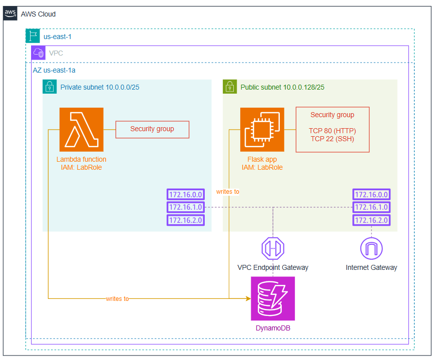

# AWS Deployment Project

## Overview

The goal of this project is to practice

1. Interacting with AWS using AWS CLI commands.
2. Configuring AWS services such as DynamoDB, VPCs, EC2 instances, and Lambda functions.
2. Inspecting AWS systems using AWS Console, AWS CLI, and CloudWatch.
2. Using GitHub Actions as a CI/CD pipeline to automate testing and deployments to AWS.
4. Performing cost analysis of AWS services.

## Project Structure

- `.aws/credentials`: AWS credentials file.
- `.github/workflows/`: GitHub Actions workflows for CI/CD.
- `app/`: The application code.
- `resources/`: Useful scripts and other resource files.
- `tests/`: Test cases for the application.

## Setup

1. Open this repository as a Devcontainer in VS Code
2. Create a branch off of `main` and do your work for this project in that branch.
2. Ensure you are in the virtual Python evironment (you should see `(.venv)` at the start of your terminal prompt)

   > If not, run `source ./venv/bin/activate` in the terminal to activate it. You may need to do this each time you load the Devcontainer.
2. Log in to AWS Academy and open the AWS Academy Learner Lab environment
3. Click the "Start Lab" button and wait for the AWS environment to initialize
4. Open the "AWS Details" button, then the "Show" button beside "AWS CLI"
5. Copy the entire contents shown in the text box into the `.aws/credentials` file. You can test that it worked by running `aws sts get-caller-identity` in the terminal. You should see your AWS account details returned.

    > **IMPORTANT:** Any time you restart the Learner Lab environment, or the environment times out, you will need to repeat the above 2 steps to update the AWS credentials. (They change on every restart.)

# Instructions

## Familiarize yourself with the project

The app in this project is quite simple: an JSON API that allows users to roll a dice using a URL like `/roll/d6` to 'roll' a 6-sided dice and return a JSON result. 

In the `app` folder, a set of core functions is in `core.py`. The results of each roll are stored in a DynamoDB table (handled in `data.py`). Both a Flask-based implementation (`flask_app.py`) and a Lambda-based implementation (`lambda_app.py`) are provided.

You can run the Flask app locally be executing `flask --app app.flask_app run --debug` in your terminal.

A set of unit tests has been provided in the `tests` folder. You can run the tests using the command `pytest` in your terminal. They should all be passing at this point.

## Set up a VPC

You will deploy both the Flask app and the Lambda app to AWS. The Flask app will run on an EC2 instance, and the Lambda app will run as a Lambda function. Both need to be deployed within a VPC.

You will place the Lambda function in a private subnet, and the EC2 instance in a public subnet so that it can have a public IP. Both subnets will have access to DynamoDB via a VPC Endpoint Gateway. Only the public subnet will have access to the internet via an Internet Gateway. See the diagram below for reference.

> **NOTE:** In a production environment, you would typically not place an EC2 instance with a public IP directly in a public subnet. Instead, you would use a load balancer to provide controlled access to instances in private subnets. However, for the purposes of this lab exercise, we are simplifying the setup by placing the EC2 instance directly in the public subnet.

Using AWS CLI commands...

1. Create a new VPC with the following specifications:
   - CIDR block: 10.0.0.0/24
   - Name tag: `csd215-vpc`
2. Create two subnets within this VPC in AZ `us-east-1a`:
   - Private subnet:
      - CIDR block: 10.0.0.0/25
      - Name tag: `csd215-subnet-private`
   - Public subnet:
      - Enable auto-assign public IPv4 address on launch.
      - CIDR block: 10.0.0.128/25
      - Name tag: `csd215-subnet-public`
3. Ensure that each subnet has its own routing table with the following configurations:
   - Private subnet
      - Routing table Name tag: `csd215-rt-private`
    - Public subnet
         - Routing table Name tag: `csd215-rt-public`
         - Add an Internet Gateway with Name tag `csd215-igw`
         - Route all internet-bound traffic to this gateway.
4. Create a VPC Endpoint Gateway to DynamoDB (service name: `com.amazonaws.us-east-1.dynamodb`)
   - Set its Name tag to `csd215-dynamodb-endpoint`
   - Associate it with BOTH private and public routing tables.
4. DELIVERABLE: Using AWS Console, take a screenshot of the VPC showing your csd215-vpc selected, and the resource map showing the two subnets with their connections to the Internet Gateway and DynamoDB Endpoint. 
   - Save this screenshot in the `deliverables` folder as `vpc-setup.png`. 

## Set up a DynamoDB table

The app needs a DynamoDB table with the following specifications:

- Table name: `dice-rolls`
- Billing mode: On-Demand (PAY_PER_REQUEST)
- Attributes:
  - `source` (String)
  - `timestamp` (Number)
- Primary key:
   - Partition key: `source`
   - Sort key: `timestamp`

1. Use the AWS CLI help command and other documentation you can find to determine the appropriate command to create this table.
2. DELIVERABLE: Paste the output of the `describe-table` sub-command into the `deliverables/resource-descriptions.txt` file.

## Prepare EC2 supports

In order to make working with an EC2 instance possible, a few things need to be set up first:

- A Security Group that allows inbound SSH and HTTP traffic.
- An Instance Profile that allows the EC2 instance to access DynamoDB.
- An SSH key pair to allow you to connect to the instance via SSH.
- A User Data script to install and run the Flask app on instance launch.

1. Create a security group within your VPC with the following specifications:
   - Name tag: `csd215-ec2-sg`
   - Inbound rules:
     - Allow SSH (TCP port 22) from anywhere.
          > NOTE: In a production environment, you would restrict this to specific known IP addresses for security reasons.
     - Allow HTTP (TCP port 80) from anywhere.
2. Create an instance profile with...
   - Name: `csd215-instance-profile`
   - The IAM role `LabRole` added to it.
     > **NOTE:** The `LabRole` role already exists in your AWS account as part of the Learner Lab environment. In a production environment, you would create a custom role with only the necessary permissions for your EC2 instance.
3. Create an SSH key pair with the following specifications:
   - Key pair name: `csd215-keypair`
   - Save the private key file (`.pem`) in your project folder.
4. Inspect the `scripts/user_data.sh` file:
   1. OBSERVE: 
      - How it installs necessary packages.
      - How it clones the application code from GitHub.
      - How it sets up and runs the Flask app using a systemd service.
      - How it uses nginx as a reverse proxy to forward HTTP requests to the Flask app.
   3. DELIVERABLE:
      - In `deliverables/reverse-proxy.md`, explain the purpose and benefits of using the nginx web server as a reverse proxy in this setup.
   2. MODIFY:
      - Change the Git clone URL to your own repository URL.

## Launch and connect to an EC2 instance

1. Launch an EC2 instance with the following specifications:
   - AMI: Amazon Linux 2023 AMI
   - Instance type: t2.nano
   - Subnet: Your public subnet
   - Security group: Your `csd215-ec2-sg` security group
   - Key pair: Your `csd215-keypair` key pair
   - Instance profile: Your `csd215-instance-profile` instance profile
   - User data script: Your modified `user_data.sh` script
   - Tag the instance with Name: `csd215-flask-instance`
   - Enable auto-assign public IPv4 address.
3. Using a web browser, navigate to the public IP address of your EC2 instance. You should see the Flask app running.
   1. Load at least a few different `/roll/d#?n=#` requests.

   > **NOTE:** To minimize costs, you should stop or terminate your EC2 instance when you are not using it.

4. DELIVERABLES: 
   1. Take a screenshot of the web browser showing the Flask app running on your EC2 instance. Save this screenshot as `deliverables/ec2-flask-app.png`.
   2. Add the output of the `describe-instances` command for your EC2 instance to `deliverables/resource-descriptions.txt`.
5. Verify that you can connect to your EC2 instance via SSH using the private key file you downloaded earlier: `ssh -i <pem file> ec2-user@<ec2 ip>` (replace `<pem file>` and `<ec2 ip>` with your actual key (.pem) file path and EC2 public IP address).
   1. OBSERVE:
      - The Flask app is running: `systemctl status diceapp`
      - The nginx service is running: `systemctl status nginx`

## Deploy the Lambda function

You will start by creating a placeholder lambda function. Then you will complete a script to automate uploading new Lambda function code.

1. Create a security group within your VPC with the following specifications:
   - Name tag: `csd215-lambda-sg`
   - Inbound rules: None (Lambda functions do not require inbound rules)
2. Create a Lambda function with the following specifications:
   - Name: `csd215-lambda`
   - Runtime: Python 3.9
   - Role: `LabRole` (The same role used for the EC2 instance provided by the AWS Academy Learner Lab)
   - VPC configuration:
     - Subnet: Your private subnet
     - Security group: Your `csd215-lambda-sg` security group
   - Use the provided `resources/lambda_placeholder.zip` file as the deployment package.
   - Handler: `lambda_app.main` (i.e. the `main` function in the `lambda_app.py` file is the entry point)
3. Use the `aws lambda invoke` command to test the function. You may use the provided `resources/lambda_playload.json` file as the input payload. Verify that the function executes successfully.
4. Use the `aws lambda list-function-url-configs` to determine the function URL for your Lambda function.
5. Using a web browser, navigate to the function URL of your Lambda function. You should see a 'Hello' message.
6. Open the `resources/deploy_lambda.sh` script and complete it to automate the process of packaging and deploying the Lambda function code.
   1. OBSERVE: The script packages the application code into a ZIP file.
   2. MODIFY: Set the `LAMBDA_NAME` variable to your Lambda function name.
   2. MODIFY: Add the AWS CLI command in step 4 of the script to update the Lambda function code with the new package.
7. Run the `resources/deploy_lambda.sh` script to deploy the Lambda function code.
8. Verify that your Lambda function was updated using the CLI or a web browser.
   1. Load at least a few different `/roll/d#?n=#` requests.
9. DELIVERABLES:
   1. Take a screenshot of the web browser showing the Lambda function output. Save this screenshot as `deliverables/lambda-function.png`.
   2. Add the output of the `get-function` command for your Lambda function to `deliverables/resource-descriptions.txt`.

## CI/CD Pipeline

It is common practice to automate deployments using CI/CD pipelines. So that any time code is pushed to the repository, tests are run automatically, and if they pass, the new code is deployed to AWS.

In this project, you will use GitHub Actions to automate the testing and deployment of both the Flask app and the Lambda function.

You will start by writing a test workflow that runs the unit tests automatically on every push to the repository.

Then you will write deployment workflows for both the Flask app and the Lambda function that will run automatically on every push to the `main` branch, but only if the tests pass.

### Test workflow

In `.github/workflows/test.yml`...

1. Trigger the workflow on every push to the repository
2. Set up a job that runs on Ubuntu latest
3. Add the following steps to the job:
   1. Checkout the repository code
   2. Set up Python 3.9
   3. Install the required Python packages from `app/requirements_flask.txt`
   4. Run the tests using `pytest`
4. Commit and push your yml file to the repository.
5. In a web browser, navigate to the "Actions" tab of your GitHub repository and verify that the test workflow runs successfully on your push.

### Lambda deployment workflow

This workflow will require the AWS credentials to be stored as GitHub Secrets in your repository settings.

1. In your GitHub repository, navigate to "Settings" > "Secrets and variables" > "Actions"
2. Add the following secrets:
   - `AWS_ACCESS_KEY_ID`: Your AWS access key ID
   - `AWS_SECRET_ACCESS_KEY`: Your AWS secret access key
   - `AWS_SESSION_TOKEN`: Your AWS session token (required for temporary credentials like those provided by AWS Academy Learner Labs)
     
     > **NOTE:** These credentials will expire when your Learner Lab environment is stopped or times out. You will need to update these secrets with new credentials if that happens.
     >
     >  Also note that in a production environment, you would only need to store the access key ID and secret access key. Session tokens are ONLY required for temporary credentials like those provided by AWS Academy Learner Labs.
3. In `.github/workflows/lambda.yml`...
   1. Trigger the workflow on 
      - Completion of the "Test" workflow
      - Manual workflow dispatch
   2. Set up a job that
      - Only runs if the "Test" workflow succeeded
      - Runs on Ubuntu latest
   3. Add the following steps to the job:
      1. Checkout the repository code
      2. Configure AWS credentials using the GitHub Secrets you created earlier
      3. Set the permissions for the `resources/deploy_lambda.sh` script to be executable
      3. Run the `resources/deploy_lambda.sh` script to deploy the Lambda function.
4. Commit and push your yml file to the repository.
5. In a web browser, navigate to the "Actions" tab of your GitHub repository and verify that the Lambda deployment workflow runs successfully on your push.

## Flask app deployment workflow

For this workflow, you will use SSH to run a deployment script on the EC2 instance. Thus, you will need to store the private key file as a GitHub Secret in your repository settings.

1. In your GitHub repository, navigate to "Settings" > "Secrets and variables" > "Actions"
2. Add a key named `EC2_KEY` and paste the entire contents of your private key file (`.pem`) as the value.
3. In `.github/workflows/ec2.yml`...
   1. Trigger the workflow on 
      - Completion of the "Test" workflow
      - Manual workflow dispatch
   2. Set up a job that
      - Only runs if the "Test" workflow succeeded
      - Runs on Ubuntu latest
   3. Add the following steps to the job:
      1. Checkout the repository code
      2. Use the `apple-boy/ssh-action` GitHub Action to connect to your EC2 instance via SSH and run a deployment script.
         - Use the `EC2_KEY` secret for authentication.
         - Use the provided `resources/deploy_ec2.sh` script as the deployment script to run on the EC2 instance.
4. Commit and push your yml file to the repository.
5. In a web browser, navigate to the "Actions" tab of your GitHub repository and verify that the EC2 deployment workflow runs successfully on your push.

## Enjoy your CI/CD pipeline

1. Make some kind of change to either the Flask app or the Lambda function code in the `app/` folder.
2. Commit and push your changes to the repository.
3. Verify that the deployment succeeds by checking the "Actions" tab in your GitHub repository.
4. Verify that your changes are live by accessing your Flask/Lambda app in a web browser.

   > **NOTE:** If you changed your Flask app, you may need to clear your browser cache or do a hard refresh (Ctrl+F5) to see the changes.

5. DELIVERABLES:
   1. Take a screenshot of the "Actions" tab showing the successful deployment workflows. Save this screenshot as `deliverables/ci-cd-pipeline.png`.
   3. Add a screenshot of your DynamoDB table showing dice rolls from both the Flask app and the Lambda function. Save this screenshot as `deliverables/dynamodb-entries.png`.

## Cost Analysis

1. Using AWS Pricing Calculator create an estimate of the monthly costs for running the resources you have created in this project.
2. How many requests per month could your Lambda function handle before it becomes more expensive than running the EC2 instance?
   1. Use the 'Description' field in the AWS Pricing Calculator to show the amount according to your calculations.
3. DELIVERABLES:
   1. Take a screenshot of your pricing summary showing
      - The total estimated monthly cost
      - The breakdown of costs by service
      - Your description of how many requests per month the Lambda function could handle before it becomes more expensive than the EC2 instance.
   2. Save this screenshot as `deliverables/cost-analysis.png`.
   
   ## Submission

   1. Ensure all deliverables are saved in the `deliverables/` folder. (Search for `DELIVERABLE` in this README to find them all.)
   2. Commit and push all your changes to your branch in the GitHub repository.
   3. In a web browser, navigate to your GitHub repository and create a Pull Request with `main` as the base branch and your branch as the compare branch.
   4. Submit the Pull Request URL to your instructor for grading.